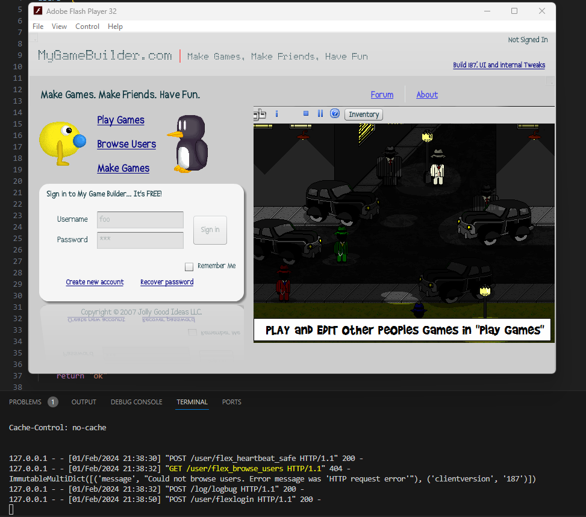

# mgb
MyGameBuilder v1 decomp/attempted server implementation

## Purpose for this project

Implementing a local server for a defunct Flash, in-browser game making site. I threw together a [playlist of videos](https://www.youtube.com/playlist?list=PLnDtXPl6_UOaScZnLomYqyjpSrxh5Xz1s) and a basic walkthrough of the site's client SWF (hosted originally at https://s3.amazonaws.com/apphost/MGB.html) to show a bit of what it was like. Apparently there are other people who fondly remember it as well, and in the interest of drawing more attention to it (or otherwise document my own working on it; I last touched on this one year ago, as of writing), I would upload what I had on its inner workings. It fortunately seems achievable to write a reimplementation with the right know-how, as the client SWF is very little obfuscated.

There was a successor to MyGameBuilder in MyGameBuilder v2, located at [build.games](https://build.games/), which adopted phaser.js alongside (and eventually replacing) the original visual actor-based engine, but as of writing this has fallen offline, likely with all the users, games and data migrated from the old site. This repository is in the hopes that if the actual site is completely gone, some element of the original site could still be used.

Open to contributions, forks, comments, etc. I'm hopeful others more technically skilled than I am might have an interest in it.

## Backend note

Backend appears to have been originally implemented with Adobe Flex (now [Apache Flex](https://flex.apache.org/)) judging from the com.adobe.flex.extras.controls package and URLs used. 

Each object in MGB like a map, actor, profile, or even friendship is an extension of the Piece class in the com.mgb.data package in the client SWF. These Pieces are saved, deleted, managed using the S3Service class.

## Files and what's implemented

- `mgb_files/` contains exported files from the SWF but is not required to rebuild/edit the SWF. 
- `storage/` consists of game music and images used in the carousel and login screen.

`backend/simple_log_server.py` has some basic poking around. It's implemented in Flask and can receive requests to /log/logbug. MGB_local_baseRailsServerName.swf will use 127.0.0.1:3000.



Testing is done with a Flash projector; these can be found online.

`backend/storage_run.ps` uses min.io to create a self-hosted S3-compatible object store to use with MGB, but I have not gotten it working.

## Modifying the SWF

I used [JPEXS](https://github.com/jindrapetrik/jpexs-decompiler) to decompile the files, and also modify scripts in the SWF. Editing ActionScript in the SWF directly is experimental but appears to work.

The MgbSystem class in com.mgb.managers contains the object baseRailsServerName which is used for server tasks like authentication, heartbeat and uploads.

Changing line 44 of MgbSystem as below will make it use a local server:

```as3
public static const baseRailsServerName:String = "http://127.0.0.1:3000";
```

Amazon S3 session management is performed in the SSSSession script in com.mgb.managers.

Of relevance is AWSAccessKeyId, s3BucketName, and S3_SOAP_URL. It appears the populateSignatureCacheFromRails() function is used for authenticating the client to modify the S3 storage, but I'm not sure. The S3Service class in the com.mgb.data package looks to handle S3 transactions as well.
